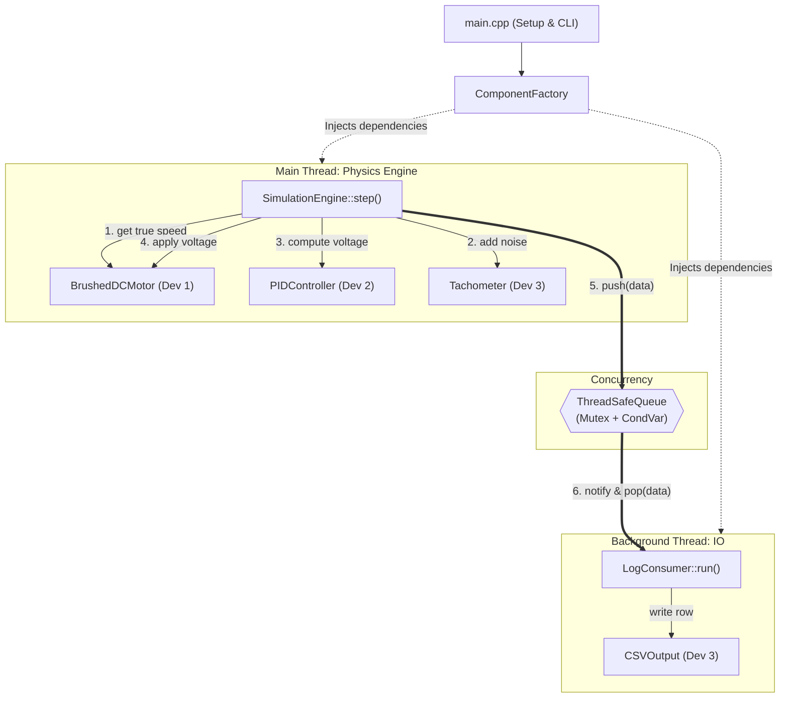
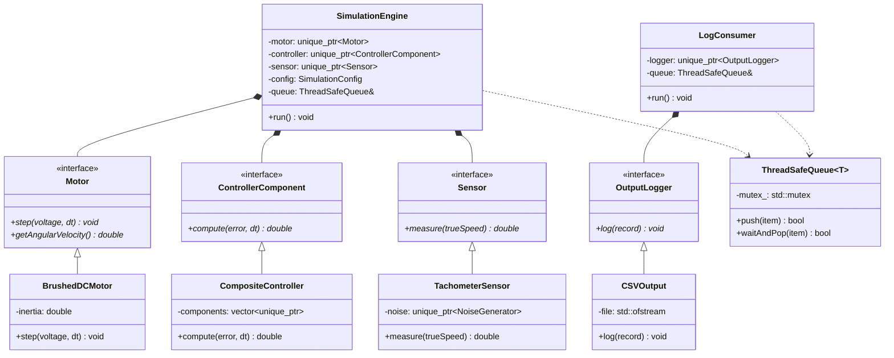

# Multithreaded DC Motor PID Control Simulator

## Overview
A high-performance, object-oriented C++ simulation of a closed-loop DC Motor system. Designed for engineering evaluations, this system simulates the physical dynamics of a brushed DC motor under load and actively stabilizes it using a finely-tuned Proportional-Integral-Derivative (PID) controller. 

The architecture is strictly decoupled and utilizes modern C++14 multithreading to separate the intense physics calculations from the disk I/O logging operations.

## Directory Structure
```text
cpp project/
├── Makefile               # Build automation
├── README.md              # Project documentation
├── build/                 # Compiled object files and simulator executable
├── include/               # Class definitions and interfaces
│   ├── BrushedDCMotor.h   # Plant models
│   ├── CompositeController.h # PID logic
│   ├── ThreadSafeQueue.h  # Concurrency primitives
│   └── ... (23 headers)
└── src/                   # Implementation files
    ├── BrushedDCMotor.cpp
    ├── ComponentFactory.cpp
    ├── main.cpp
    └── ... (19 sources)
```

## Build & Run Instructions

**Prerequisites:** A standard C++14 compliant compiler (e.g., `g++`) and `make`.

To completely rebuild the project and execute the simulation immediately with default parameters:
```bash
make clean
make run
```

To compile the project and run it with custom simulation parameters via the CLI:
```bash
make
./build/simulator --duration 20.0 --target 150.0 --kp 5.0 --ki 2.5 --kd 0.1 --noise-level 0.05 --output custom_log.csv
```

**Supported CLI Parameters:**
* `--duration <seconds>` : Total simulation time (default 10.0)
* `--timestep <seconds>` : Physics integration step size (default 0.01)
* `--target <rad/s>`     : Target angular velocity (default 100.0)
* `--kp <value>`         : Proportional gain (default 1.0)
* `--ki <value>`         : Integral gain (default 0.0)
* `--kd <value>`         : Derivative gain (default 0.0)
* `--voltage-limit <V>`  : Maximum voltage output (default 12.0)
* `--noise-level <val>`  : Injects synthetic Gaussian noise into the sensor
* `--output <file.csv>`  : Name of the generated log file

## Architecture

### System Flow
The following flowchart illustrates the dependency injection at startup and the chronological execution of a single simulation step across the thread boundary:



### Class Diagram
The system relies strictly on interface-based design to decouple the plant, controller, and environment.



### Object-Oriented Design
The codebase relies heavily on SOLID principles and interface-based design to allow independent parallel development across team members:
- **Factory Pattern**: The `ComponentFactory` handles the instantiation of all concrete dependencies (Motor, Controller, Sensor, Logger), injecting them cleanly into the simulation engine.
- **Composite Pattern**: The control logic (`CompositeController`) acts as a unified `ControllerComponent` interface that transparently delegates calculations to its leaf children (`PController`, `IController`, `DController`).

### Multithreading Design
To prevent file I/O latency from blocking the critical physics step calculations, the simulation is heavily parallelized using a classic Producer-Consumer pattern:
- **Producer (`SimulationEngine`)**: Runs on the main thread. Responsible purely for stepping the motor physics, polling the sensor, calculating the PID error, and generating a `LogRecord`.
- **Consumer (`LogConsumer`)**: Runs on a dedicated background thread. Safely pops records from the queue and handles formatting and writing them to the CSV file.
- **`ThreadSafeQueue`**: A custom synchronization primitive using `std::mutex` and `std::condition_variable` that transports `LogRecord` objects across the thread boundary without race conditions, enforcing capacity limits to prevent memory ballooning.
